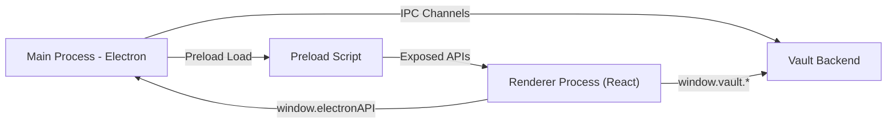

# Secura Vault

Secura is an Electron-based secure vault application for managing passwords and sensitive data. It combines **Electron**, **React**, **TypeScript**, **Zustand**, and **Tailwind/Radix UI** to provide a secure, responsive, and user-friendly interface.

---

## Table of Contents

- [Features](#features)  
- [Architecture](#architecture)  
- [Getting Started](#getting-started)  
- [Project Structure](#project-structure)  
- [Vault Backend](#vault-backend)  
- [UI Components](#ui-components)  
- [Screens](#screens)  
- [Utilities & Stores](#utilities--stores)  
- [Types](#types)  
- [License](#license)  

---

## Features

- **Secure vault** with AES-256-GCM encryption  
- **Master password** unlock with session storage  
- CRUD operations for secrets: add, edit, delete  
- Categorized secrets with search and filter  
- Custom **frameless window** with title bar controls  
- Radix + Tailwind UI primitives (buttons, inputs, switches, modals)  
- Auto-lock, clipboard timeout
- React Router-based navigation  

---

## Architecture



---

## Core flow:
1. User enters master password
2. Renderer calls vault.unlock
3. Main process invokes unlockVault
4. Returns session key → stored in Zustand
5. Renderer fetches secrets → displays in UI

---

## Getting Started

### Prerequisites
- Node.js >= 18
- npm or yarn
- Electron-compatible OS

### Installation
```bash
git clone https://github.com/yourusername/secura.git
cd secura
npm install
```

### Running
```bash
# Start Electron app
npm run dev
```

### Build
```bash
npm run build
npm run package
```

---

## Project Structure

### Main Process
- `src/main/index.ts` – Entry point, creates frameless window, sets up IPC channels for vault operations and window controls, manages app lifecycle.

### Preload
- `src/preload/index.ts` – Bridges main and renderer safely using `contextBridge`.
- `src/preload/index.d.ts` – TypeScript types for `window.electronAPI` and `window.vault`.

### Renderer
- `src/renderer/src/main.tsx` – Entrypoint rendering `<App>` with `HashRouter`.
- `src/renderer/index.html` – HTML scaffold for root div.

---

## Vault Backend
- `crypto.ts` – Key derivation via Argon2id (310k iterations)
- `vaultUnlock.ts` – Initial vault setup & unlock logic
- `vaultStore.ts` – CRUD operations: read, write, encrypt, decrypt secrets

---

## UI Components

### Primitives (src/renderer/src/components/ui)

- **Button** – styled with variants (size, intent, disabled, ghost)  
- **Input / Textarea / Label / Select / Switch** – Tailwind + Radix  
- **Icons** – Maps secret type to Lucide icons  
- **Modals & Dialogs**  
  - **AddEditSecretModal** – add/edit secret with validation & password strength  
  - **DeleteConfirmDialog** – confirm deletion  
  - **CustomTitleBar** – frameless window controls  
  - **EmptyDetails / SecretDetails** – secret detail views  

### Lists

- **SecretsList** – sidebar with filtering, search, add button  
- **Sidebar** – category navigation + settings + lock vault  
- **VaultLogo** – branding component  

### Screens

- **UnlockVault.tsx** – Master password entry, unlock logic  
- **VaultScreen.tsx** – Main vault UI: sidebar, secret list, secret details  
- **SettingsScreen.tsx** – Preferences: auto-lock, clipboard timeout, biometric toggle  

### Utilities & Stores

- **utils.ts** – helper functions (e.g., cn for classNames)  
- **masterPasswordStore.ts** – Zustand store: sessionKey & unlocked state  
- **secretTypes.ts** – Maps secret types to human-readable labels  

### Types

- **global.d.ts** – Extends global Window with electron & vault  
- **vault.ts** – Core vault types:

| Type           | Description |
|----------------|-------------|
| SecretType     | union of secret categories |
| Secret         | secret object with id, name, value, metadata |
| VaultSettings  | user preferences |
| ViewMode       | 'list' or 'details' |
| Category       | secret filter categories |

---
## License


This README provides a **comprehensive overview** of your project: architecture, features, folder structure, key components, screens, types, and vault backend.  

I can also generate a **shorter, “developer quickstart” version** optimized for new contributors if you want. Do you want me to do that?
